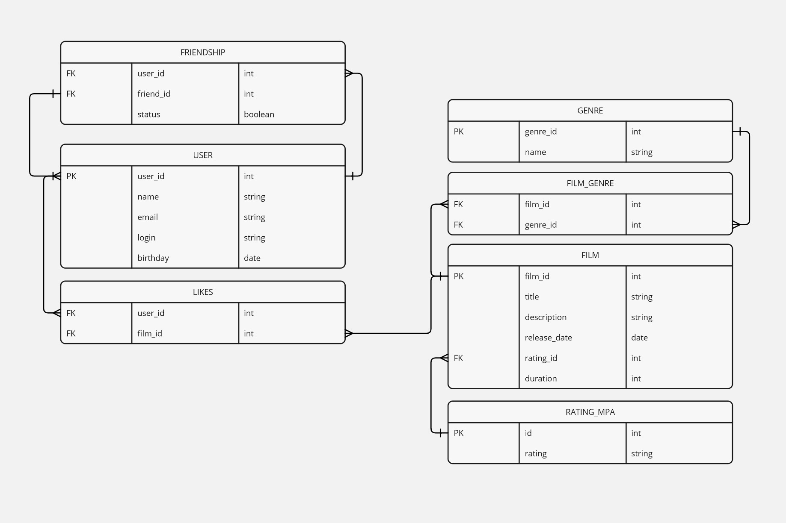

# Filmorate Project

## Описание проекта

Filmorate — это приложение для работы с фильмами и пользователями. Оно позволяет пользователям добавлять фильмы, ставить лайки, дружить с другими пользователями и делиться своими предпочтениями. Все данные сохраняются в базе данных, и структура базы данных представлена в виде ER-диаграммы ниже.

## ER-диаграмма проекта

Ниже представлена ER-диаграмма, отображающая структуру базы данных для проекта Filmorate:



## Описание ER-диаграммы

- **User**: Таблица хранит информацию о пользователях:
  - `user_id` — уникальный идентификатор пользователя.
  - `name` — имя пользователя.
  - `email` — электронная почта пользователя.
  - `login` — логин пользователя.
  - `birthday` — дата рождения пользователя.
  - Каждый пользователь может иметь друзей, связи между пользователями хранятся в таблице `Friendship`. Пользователи также могут ставить лайки фильмам, информация об этом хранится в таблице `Likes`.

- **Film**: Таблица хранит информацию о фильмах:
  - `film_id` — уникальный идентификатор фильма.
  - `title` — название фильма.
  - `description` — описание фильма.
  - `release_year` — год выпуска фильма.
  - `rating_id` —  идентификатор возрастного рейтинга фильма (ссылка на таблицу `Rating_MPA`).
  - `duration` — продолжительность фильма в минутах.
  - Каждый фильм может принадлежать нескольким жанрам, и связь между фильмами и жанрами хранится в таблице `Film_Genre`.

- **Genre**: Таблица хранит список возможных жанров фильмов:
  - `genre_id` — уникальный идентификатор жанра.
  - `name` — название жанра.

- **Film_Genre**: Промежуточная таблица, связывающая фильмы и жанры:
  - `film_id` — идентификатор фильма.
  - `genre_id` — идентификатор жанра.
  - Один фильм может иметь несколько жанров, и один жанр может быть связан с несколькими фильмами.

- **Friendship**: Таблица хранит информацию о дружбе между пользователями:
  - `user_id` — идентификатор пользователя, отправившего запрос на добавление в друзья.
  - `friend_id` — идентификатор пользователя, который получил запрос на добавление в друзья.
  - `status` — статус дружбы (неподтверждённая или подтверждённая).
 
- **Likes**: Таблица хранит информацию о лайках, которые пользователи ставят фильмам:

    - `user_id` — идентификатор пользователя, который поставил лайк.
    - `film_id` — идентификатор фильма, которому был поставлен лайк.

- **Rating_MPA**: Таблица хранит возможные возрастные рейтинги фильмов:

    - `id` — уникальный идентификатор рейтинга.
   - ` rating` — значение возрастного рейтинга (например, G, PG-13, R, NC-17).
  

## Примеры SQL-запросов

### Получить все фильмы:
```sql
SELECT * FROM film;
```
### Получить все жанры фильма:
```sql

SELECT g.name 
FROM genre g
JOIN film_genre fg ON g.genre_id = fg.genre_id
WHERE fg.film_id = :film_id;
```
### Получить друзей пользователя:

```sql

SELECT u.name 
FROM user u
JOIN friendship f ON u.user_id = f.friend_id 
WHERE f.user_id = :user_id AND f.status = 'confirmed';
```
### Получить фильмы по возрастному рейтингу:

```sql

SELECT * 
FROM film 
WHERE rating_id = (SELECT id FROM rating_mpa WHERE rating = 'PG-13');
```
### Получить популярные фильмы (сортировка по количеству лайков):

```sql

SELECT f.title, COUNT(l.user_id) AS likes 
FROM film f
LEFT JOIN likes l ON f.film_id = l.film_id
GROUP BY f.film_id
ORDER BY likes DESC
LIMIT 10;
```
## Установка и запуск

### Склонируйте репозиторий:

  ```  bash

git clone https://github.com/educational1234/java-filmorate.git
```
### Перейдите в папку проекта:

```bash

cd filmorate
```
### Запустите приложение с помощью Maven:

```bash

mvn spring-boot:run
```
### Приложение будет доступно по адресу: http://localhost:8080
